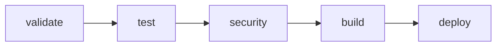

# GitLab CI/CD Pipeline Guide

This comprehensive guide covers the GitLab CI/CD pipeline implementation for TrakBridge, including setup, configuration, and advanced features.

## 🚀 Overview

The TrakBridge GitLab CI/CD pipeline provides a complete DevOps solution with:

- **Multi-environment deployments** (development, staging, production)
- **Comprehensive testing suite** (unit, integration, E2E, performance)
- **Enhanced security scanning** with GitLab's built-in features
- **Container registry integration** and multi-architecture builds
- **Slack notifications** and advanced reporting
- **Environment management** with approval workflows

## 🏗️ Pipeline Architecture

### Pipeline Stages



1. **validate** - Code quality, linting, formatting checks
2. **test** - Unit, integration, E2E, and performance tests
3. **security** - SAST, dependency scanning, container scanning
4. **build** - Docker image builds and testing (main, feature branches, and tagged releases)
5. **deploy** - Environment-specific deployments (development, staging, production, feature branches)

### Environment Strategy

| Environment | Trigger | Approval | URL | Description |
|-------------|---------|----------|-----|-------------|
| **Development** | `main` branch commits | Automatic | `http://localhost:5000` | Latest development build |
| **Feature Branches** | Any non-main branch | Manual | `http://localhost:500X` | Dynamic review environments |
| **Staging** | Release candidate tags (`v*-rc*`) | Manual | `http://localhost` | Production-like testing |
| **Production** | Stable release tags (`v*.*.*`) | Manual | Container registries | Production releases |

## 🔧 Setup and Configuration

### 1. GitLab Project Setup

1. **Import/Create Project** in GitLab
2. **Enable GitLab Container Registry** (Settings → General → Visibility)
3. **Configure GitLab Runners** (CI runners for testing, CD runners for builds/deployments)
4. **Set up Environment Protection** (Settings → CI/CD → Environments)

### 2. Required GitLab CI/CD Variables

Navigate to **Settings → CI/CD → Variables** and add:

#### Required Variables
```bash
# Docker Hub Integration (for production releases)
DOCKERHUB_USERNAME=your-dockerhub-username
DOCKERHUB_TOKEN=your-dockerhub-access-token

# Environment-specific deployment variables
DEPLOY_ENVIRONMENT=development  # For manual deployments
```

#### Protected Variables (Production Only)
Mark these variables as **Protected** to restrict access to protected branches/tags:
- `DOCKERHUB_TOKEN`

### 3. GitLab Runner Configuration

#### Shell Runner (Recommended)
```toml
# /etc/gitlab-runner/config.toml
[[runners]]
  name = "trakbridge-shell-runner"
  url = "https://gitlab.com/"
  token = "your-runner-token"
  executor = "shell"
  
  [runners.custom_build_dir]
  enabled = true
  
  [runners.cache]
    Type = "local"
    Path = "/opt/cache"
    Shared = true
```

#### Docker Runner (Alternative)
```toml
[[runners]]
  name = "trakbridge-docker-runner"
  url = "https://gitlab.com/"
  token = "your-runner-token"
  executor = "docker"
  
  [runners.docker]
    image = "python:3.12-slim"
    privileged = true
    volumes = ["/certs/client", "/cache"]
```

### 4. Environment Protection Rules

Configure environment protection in **Settings → CI/CD → Environments**:

#### Development Environment
- **Protected:** No
- **Deployment tier:** Development
- **Auto-stop:** 24 hours

#### Feature Branch Environments (Review Apps)
- **Protected:** No
- **Deployment tier:** Development
- **Auto-stop:** 1 week
- **Dynamic naming:** `review/$CI_COMMIT_REF_SLUG`
- **Manual deployment:** Required
- **Port range:** 5001-5099

#### Staging Environment  
- **Protected:** Yes
- **Allowed to deploy:** Maintainers
- **Deployment tier:** Staging
- **Auto-stop:** 1 week

#### Production Environment
- **Protected:** Yes
- **Allowed to deploy:** Maintainers only
- **Required approvals:** 2
- **Deployment tier:** Production
- **Auto-stop:** Never

## 🧪 Testing Pipeline

### Unit Tests
- **Coverage requirement:** 75% minimum
- **Branch coverage:** Enabled
- **Database:** PostgreSQL service for integration
- **Artifacts:** JUnit reports, coverage reports

### Integration Tests
- **Database integration:** PostgreSQL service
- **API endpoint testing**
- **Service layer validation**
- **Artifacts:** JUnit reports

### End-to-End Tests
- **Full application workflow**
- **Health endpoint validation**
- **User journey testing**
- **Artifacts:** JUnit reports

### Performance Tests
- **Response time benchmarks**
- **Load testing capabilities**
- **Performance regression detection**
- **Artifacts:** Performance reports

## 🔒 Security Features

### GitLab Built-in Security Scanning

The pipeline automatically includes GitLab's security templates:

```yaml
include:
  - template: Security/SAST.gitlab-ci.yml
  - template: Security/Dependency-Scanning.gitlab-ci.yml
  - template: Security/Container-Scanning.gitlab-ci.yml
  - template: Security/License-Scanning.gitlab-ci.yml
  - template: Security/Secret-Detection.gitlab-ci.yml
```

### Security Jobs

| Job | Description | Artifacts |
|-----|-------------|-----------|
| **SAST** | Static Application Security Testing | SARIF reports |
| **Dependency Scanning** | Vulnerability assessment of dependencies | Dependency reports |
| **Container Scanning** | Docker image vulnerability analysis | Container reports |
| **License Scanning** | License compliance checking | License reports |
| **Secret Detection** | Scan for exposed secrets | Secret detection reports |

### Custom Security Tests
- **Bandit security linting**
- **Safety dependency checks**
- **Custom TrakBridge security validations**
- **Configuration security validation**

## 🐳 Container Registry Integration

### GitLab Container Registry

**Automatic Configuration:**
- Registry URL: `$CI_REGISTRY_IMAGE`
- Authentication: Automatic via `$CI_REGISTRY_USER` and `$CI_REGISTRY_PASSWORD`
- Image tags: `$CI_COMMIT_SHA`, branch names, version tags

**Image Naming Convention:**
```
# Main branch
registry.gitlab.com/username/trakbridge:latest
registry.gitlab.com/username/trakbridge:main
registry.gitlab.com/username/trakbridge:dev

# Feature branches (dynamic)
registry.gitlab.com/username/trakbridge:feature-new-tracker
registry.gitlab.com/username/trakbridge:hotfix-bug-fix
registry.gitlab.com/username/trakbridge:develop

# Tagged releases
registry.gitlab.com/username/trakbridge:v1.2.3
registry.gitlab.com/username/trakbridge:stable
```

### Docker Hub Integration

**Production Release Process:**
1. Build image with GitLab Container Registry
2. Tag for production release
3. Push to both GitLab Container Registry and Docker Hub
4. Multi-architecture support (AMD64, ARM64)

**Docker Hub Images:**
```
emfoursolutions/trakbridge:v1.2.3
emfoursolutions/trakbridge:latest
emfoursolutions/trakbridge:stable
```

## 🚀 Deployment Process

### Development Deployment

**Trigger:** Push to `main` branch
**Process:**
1. Build and test Docker image
2. Pull image from GitLab Container Registry
3. Deploy using `scripts/deploy.sh`
4. Health check validation
5. Native GitLab Slack notifications

**Access:**
```bash
# Application URL
http://localhost:5000

# Default credentials
Username: admin
Password: TrakBridge-Setup-2025!
```

### Feature Branch Deployment (Dynamic Environments)

**Trigger:** Manual deployment from any feature branch
**Process:**
1. Build branch-specific Docker image (`trakbridge:branch-name`)
2. Create dynamic environment with unique naming
3. Deploy to dynamically allocated port (5001-5099 range)
4. Health check validation
5. Environment automatically stops after 1 week

**Features:**
- **Dynamic Environment Names:** `review/feature-branch-name`
- **Port Allocation:** Hash-based port assignment prevents conflicts
- **Automatic Cleanup:** Environments auto-stop when branches are deleted
- **Manual Control:** Start/stop environments as needed
- **Isolated Testing:** Each feature branch gets its own deployment

**Usage:**
```bash
# Manual deployment trigger
# 1. Push to feature branch (triggers build)
# 2. Go to GitLab CI/CD → Pipelines → Manual Actions
# 3. Click "deploy-feature-branch" to deploy
# 4. Access via dynamic URL: http://localhost:500X

# Environment management
# - View: GitLab → Deployments → Environments
# - Stop: Click "Stop" button or run "stop-feature-branch" job
# - Auto-cleanup: Environments stop after 1 week
```

**Port Allocation System:**
```bash
# Ports are dynamically assigned based on branch name hash
# Range: 5001-5099 (99 concurrent feature deployments possible)
# Algorithm: 5001 + (branch_hash % 99)

# Examples:
# feature/new-tracker    → http://localhost:5023
# hotfix/bug-fix        → http://localhost:5067
# feature/gps-provider  → http://localhost:5041
```

### Staging Deployment

**Trigger:** Release candidate tags (`v1.2.3-rc1`)
**Process:**
1. Manual approval required
2. Deploy production-like environment
3. Comprehensive validation testing
4. Performance benchmarking
5. UAT readiness notification

**Features:**
- Nginx reverse proxy
- PostgreSQL database
- Production-like configuration
- Monitoring and logging

### Production Release

**Trigger:** Stable release tags (`v1.2.3`)
**Process:**
1. Manual approval required (2 approvers)
2. Multi-architecture image build
3. Push to GitLab Container Registry
4. Push to Docker Hub
5. Production readiness validation
6. Release announcement

## 📢 GitLab Slack App Integration

### Modern Native Integration

TrakBridge uses GitLab's native Slack app integration instead of legacy webhooks for better functionality and security.

### Setup GitLab for Slack App

#### 1. Install GitLab for Slack App

**From GitLab Project Settings:**
1. Navigate to **Settings → Integrations**
2. Search for "GitLab for Slack app"
3. Click **Install GitLab for Slack app**
4. Follow the authentication flow to connect your Slack workspace

**From Slack App Directory (Alternative):**
1. Visit the [GitLab for Slack page](https://slack.com/apps/A676ADMV5-gitlab)
2. Click **Add to Slack**
3. Authorize the app for your workspace
4. Link your GitLab account

#### 2. Configure CI/CD Notifications

1. **Access Integration Settings:**
   - In your GitLab project: **Settings → Integrations → GitLab for Slack app**

2. **Configure Notification Events:**
   - ✅ **Pipeline status changes** - Get notified when CI/CD pipelines succeed or fail
   - ✅ **Deployments started/finished** - Track deployment progress
   - ✅ **Alerts and vulnerabilities** - Security notifications

3. **Advanced Notification Settings:**
   - **Notify only broken pipelines:** Check this to receive only failure notifications
   - **Select branches:** Choose which branches trigger notifications (main, develop, etc.)
   - **Filter by labels:** Add specific labels to filter notifications
   - **Channel selection:** Up to 10 Slack channels can receive notifications per event

#### 3. Slack Channel Configuration

**For Public Channels:**
- GitLab for Slack app automatically has access

**For Private Channels:**
1. Invite the GitLab app to your private channel:
   ```
   /invite @GitLab
   ```
2. The app will now be able to send notifications to the private channel

### Notification Features

#### Built-in CI/CD Notifications
- **Pipeline Success/Failure:** Automatic notifications when pipelines complete
- **Deployment Status:** Updates on development, staging, and production deployments
- **Security Alerts:** Notifications for security scan findings
- **Rich Formatting:** Native Slack message formatting with buttons and actions

#### Interactive Slash Commands
The GitLab Slack app provides powerful slash commands for CI/CD management:

```bash
# Trigger deployments directly from Slack
/gitlab <project> deploy <from> to <to>

# View pipeline status
/gitlab <project> pipeline status

# Get project information
/gitlab <project> info
```

### Notification Examples

#### Successful Pipeline
```
✅ Pipeline #123 passed for TrakBridge

Branch: main
Commit: abc123ef - Add new GPS provider support
Duration: 8m 32s

[View Pipeline] [View Commit]
```

#### Failed Pipeline
```
❌ Pipeline #124 failed for TrakBridge

Branch: feature/new-tracker
Commit: def456gh - Fix integration tests
Failed Stage: test
Duration: 5m 18s

[View Pipeline] [View Logs] [Retry Pipeline]
```

#### Deployment Notification
```
🚀 Deployment to staging completed for TrakBridge

Environment: staging
Version: v1.2.3-rc1
Commit: abc123ef
Duration: 3m 45s

[View Environment] [View Pipeline]
```

### Advantages Over Webhook Integration

- ✅ **Native GitLab Integration:** No custom webhook configuration required
- ✅ **Interactive Commands:** Deploy and manage projects directly from Slack
- ✅ **Granular Control:** Configure notifications per event type and branch
- ✅ **Rich Formatting:** Better message formatting with buttons and actions
- ✅ **Security:** No need to manage webhook URLs or tokens
- ✅ **Reliability:** Built-in retry and error handling
- ✅ **User Linking:** Links Slack users to GitLab accounts for personalized notifications

## 🎯 Pipeline Optimization

### Caching Strategy

The pipeline uses comprehensive caching for performance:

```yaml
cache:
  - key: "pip-$CI_COMMIT_REF_SLUG-$PYTHON_VERSION"
    paths:
      - .pip-cache/
    policy: pull-push
  - key: "python-venv-$CI_COMMIT_REF_SLUG-$PYTHON_VERSION"
    paths:
      - .venv/
    policy: pull-push
```

### Parallel Execution

Tests run in parallel for optimal performance:
- Unit tests with coverage
- Integration tests with database
- End-to-end tests
- Performance benchmarks
- Security scans

### Resource Optimization

Jobs are configured with appropriate timeouts and resource limits:
- **Validation jobs:** 5-15 minutes
- **Test jobs:** 15-20 minutes
- **Build jobs:** 45 minutes
- **Deploy jobs:** 30 minutes

## 📊 Monitoring and Reporting

### Pipeline Artifacts

| Stage | Artifacts | Retention |
|-------|-----------|-----------|
| **Test** | JUnit reports, coverage reports | 14 days |
| **Security** | SAST reports, vulnerability scans | 1 week |
| **Build** | Docker images, build logs | 7 days |
| **Deploy** | Deployment logs, health checks | 30 days |
| **Notify** | Test summaries, reports | 30 days |

### GitLab Features Utilized

- **Merge Request Pipelines:** Validation on MRs
- **Branch Pipelines:** Full pipeline on branch pushes
- **Tag Pipelines:** Release pipelines on version tags
- **Scheduled Pipelines:** Daily security scans
- **Manual Pipelines:** On-demand deployments

### Pipeline Analytics

Access pipeline analytics in GitLab:
- **Analytics → CI/CD Analytics**
- **Monitor → Error Tracking**
- **Security & Compliance → Security Dashboard**

## 🔧 Troubleshooting

### Common Issues

#### 1. Runner Availability
```bash
# Check runner status
gitlab-runner list

# Restart runner
gitlab-runner restart
```

#### 2. Docker Build Failures
```bash
# Check Docker daemon
docker info

# Clean up Docker resources
docker system prune -af
```

#### 3. Security Scan Failures
- Check **Security → Security Dashboard**
- Review SAST findings
- Update dependencies if vulnerabilities found

#### 4. Deployment Failures
```bash
# Check deployment logs
docker-compose logs

# Verify health endpoints
curl http://localhost:5000/api/health
```

### Pipeline Debugging

Enable debug logging:
```yaml
variables:
  CI_DEBUG_TRACE: "true"  # Enable debug output
  DOCKER_BUILDKIT: 1      # Better Docker build output
```

### Health Check Validation

The pipeline includes comprehensive health checks:
```bash
# Manual health check
scripts/health-check.sh --url http://localhost:5000 --verbose

# Performance validation
scripts/health-check.sh --url http://localhost --performance
```

## 🚀 Advanced Configuration

### Custom Pipeline Variables

Override default behavior with custom variables:

```yaml
variables:
  # Custom coverage threshold
  COVERAGE_THRESHOLD: "80"
  
  # Custom test configuration
  PYTEST_MAXFAIL: "5"
  PYTEST_TIMEOUT: "600"
  
  # Custom deployment profiles
  DEPLOY_PROFILES: "postgres,redis,nginx"
```

### Multi-Project Pipelines

For complex deployments across multiple projects:

```yaml
# Trigger downstream pipeline
trigger-deployment:
  stage: deploy
  trigger:
    project: group/infrastructure-project
    branch: main
    strategy: depend
```

### Review Apps

Enable review apps for merge requests:

```yaml
review:
  stage: deploy
  script:
    - deploy-review-app.sh
  environment:
    name: review/$CI_COMMIT_REF_SLUG
    url: http://review-$CI_COMMIT_REF_SLUG.example.com
    on_stop: stop-review
  only:
    - merge_requests
```

## 📚 Additional Resources

### GitLab Documentation
- [GitLab CI/CD](https://docs.gitlab.com/ee/ci/)
- [GitLab Container Registry](https://docs.gitlab.com/ee/user/packages/container_registry/)
- [GitLab Security](https://docs.gitlab.com/ee/user/application_security/)
- [GitLab Environments](https://docs.gitlab.com/ee/ci/environments/)

### TrakBridge Resources
- [Installation Guide](INSTALLATION.md)
- [Docker Security Guide](DOCKER_SECURITY.md)
- [Testing Guide](TESTING_GUIDE.md)
- [GitLab Slack App Setup](https://docs.gitlab.com/user/project/integrations/gitlab_slack_application/)

### Migration Resources
- [GitHub Actions to GitLab CI/CD Migration](GITHUB_TO_GITLAB_MIGRATION.md)
- [Container Registry Migration](CONTAINER_REGISTRY_MIGRATION.md)

---

*This pipeline leverages GitLab's advanced CI/CD features including native Slack app integration to provide enterprise-grade automation, security, and deployment capabilities for TrakBridge.*